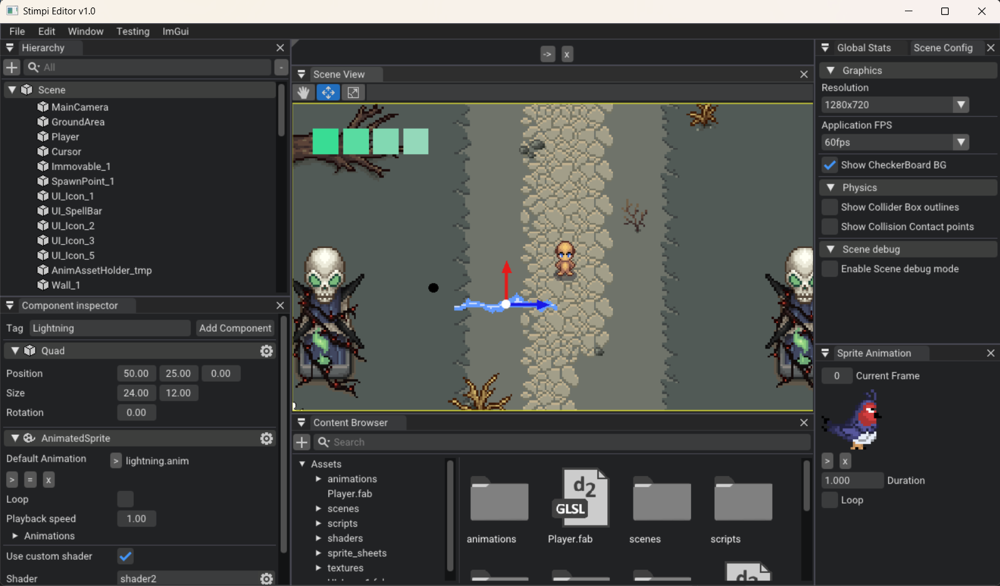
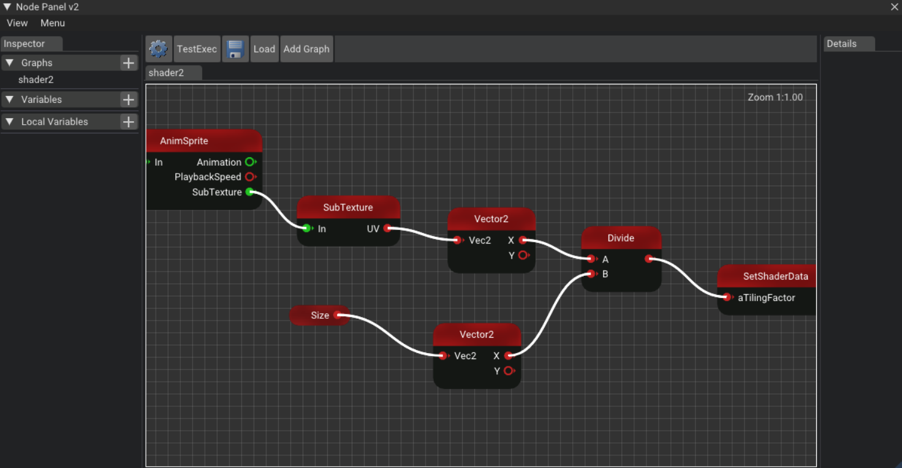

# 2D Game Engine

- C++ Core runtime
- C# Scripting
- [ImGui](https://github.com/ocornut/imgui) based Editor
- [Box2D](https://github.com/erincatto/box2d) physics
- [EnTT](https://github.com/skypjack/entt) as ECS
- [YAML](https://github.com/yaml) for serialization

## Editor

Powered by ImGui. Scene editing, Component based Game Pbjects editing (Entites), Prefabs, Node Graph, and more to come.

### Node Graph

Support for custom runtime dynamic shaders trough Node Graph

## Motivation

Hobby project to explore the endless world of Game Engine developement and the challenges it provides. Playground project for re-inventing the wheel with the common-like features and eventually tring out something new and exciting.